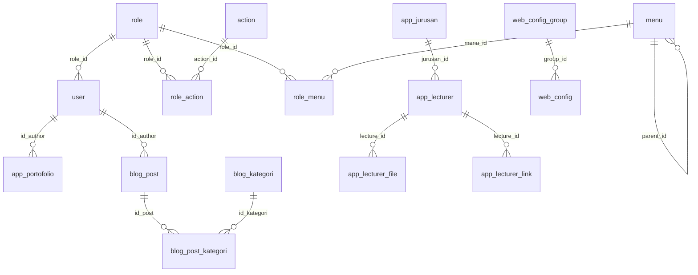

# Audit Infrastruktur, Schema Database, dan Sitemap

Tanggal audit: 18 Juni 2026  
Project path: `C:\Backup Codex\html\html\jauari.com-l12`  
URL lokal saat audit: `http://127.0.0.1:8001/`  
Database: `db_jauari`

## Ringkasan Eksekutif

Aplikasi ini adalah portfolio/personal site berbasis Laravel 12 dengan halaman publik single-page dan area admin berbasis Breeze/CoreUI. Data utama dibaca dari MySQL legacy `db_jauari`, sedangkan migration Laravel bawaan belum merepresentasikan schema aktual database.

Temuan utama:

- Stack lokal: Laravel 12.60.2, PHP 8.2.12, MySQL, Vite, Tailwind, Alpine.js, CoreUI Bootstrap admin.
- Halaman publik menggunakan Blade + Tailwind + Alpine, sedangkan dashboard/admin memakai asset CoreUI terpisah.
- Koneksi database menggunakan MySQL lokal `127.0.0.1:3306`, database `db_jauari`, user `jauari`. Password tidak dicatat di laporan.
- Schema aktual memiliki 30 tabel MySQL. Laravel migration aktif di project hanya 3 file bawaan Laravel, dan `php artisan migrate:status` gagal karena tabel `migrations` tidak ada; database legacy memakai tabel `migration` singular.
- `APP_ENV=local` dan `APP_DEBUG=true`, cocok untuk lokal tetapi wajib dimatikan sebelum production.
- Backup database terakhir yang terdeteksi: `backups/db_jauari_20260525_143338.sql`.

## Infrastruktur Aplikasi

### Runtime dan Framework

| Komponen | Nilai |
|---|---|
| Framework | Laravel Framework 12.60.2 |
| PHP CLI | 8.2.12 |
| Composer | 2.9.7 |
| Environment | `local` |
| Debug | `true` / enabled |
| URL app | `http://localhost` di `.env`; sedang diakses via `http://127.0.0.1:8001` |
| Database driver | `mysql` |
| Cache | `file` |
| Session | `file` |
| Queue | `sync` |
| Mail | `log` |
| Views | cached saat audit |

### Dependency Utama

PHP:

- `laravel/framework`
- `laravel/tinker`
- `laravel/breeze` untuk auth scaffolding
- `phpunit/phpunit` untuk test
- `laravel/pint`, `laravel/pail`, `laravel/sail` sebagai tooling dev

JavaScript/CSS:

- `vite`
- `tailwindcss`
- `@tailwindcss/forms`
- `alpinejs`
- `axios`
- `@coreui/coreui`
- `@coreui/icons`
- `simplebar`

### Struktur Asset Frontend

| Entry | Fungsi |
|---|---|
| `resources/css/app.css` | Tailwind untuk halaman publik dan auth guest |
| `resources/js/app.js` | Bootstrap JS Laravel + Alpine.js |
| `resources/css/admin.css` | CoreUI CSS, CoreUI icons, simplebar, dan custom admin |
| `resources/js/admin.js` | CoreUI JS, simplebar, dan header behavior admin |
| `vite.config.js` | Build 4 entry: `app.css`, `app.js`, `admin.css`, `admin.js` |

Catatan: pemisahan asset publik/admin sudah tepat karena CoreUI tidak ikut dimuat di halaman publik.

### Folder Publik dan Upload

| Path | Catatan |
|---|---|
| `public/build` | Output Vite production build |
| `public/uploads/app_image` | Asset gambar aplikasi |
| `public/uploads/app_services` | Asset layanan |
| `public/uploads/blog` | Gambar blog |
| `public/uploads/klien` | Logo klien |
| `public/uploads/portofolio` | Gambar portfolio |
| `public/uploads/user_image` | Gambar user |
| `public/uploads/cv.pdf` | File CV publik |
| `public/uploads/scene.glb` | Asset 3D publik |

Backup production perlu mencakup database dan seluruh folder `public/uploads`.

## Konfigurasi Environment

Nilai penting yang terbaca dari `.env`, dengan secret disamarkan:

```env
APP_NAME=Jauari Portofolio
APP_ENV=local
APP_DEBUG=true
APP_URL=http://localhost
DB_CONNECTION=mysql
DB_HOST=127.0.0.1
DB_PORT=3306
DB_DATABASE=db_jauari
DB_USERNAME=jauari
CACHE_STORE=file
SESSION_DRIVER=file
QUEUE_CONNECTION=sync
MAIL_MAILER=log
AUTH_USER_TABLE=user
```

Rekomendasi production:

- Set `APP_ENV=production`.
- Set `APP_DEBUG=false`.
- Set `APP_URL` ke domain final.
- Jalankan `php artisan config:cache`, `route:cache`, dan `view:cache` setelah deploy.
- Pastikan `APP_KEY` tetap rahasia dan tidak masuk dokumentasi publik.

## Arsitektur Aplikasi

### Modul Utama

| Modul | File utama | Fungsi |
|---|---|---|
| Public site | `app/Http/Controllers/SiteController.php` | Mengambil data portfolio, publikasi, bimbingan, layanan, klien, blog, gambar profil/hero/about |
| Public layout | `resources/views/layouts/main.blade.php` | Navbar publik, footer, modal Alpine untuk portfolio/blog |
| Homepage | `resources/views/site/home.blade.php` | Single-page portfolio dengan anchor section |
| Admin layout | `resources/views/layouts/app.blade.php` | CoreUI shell: sidebar, header, dropdown akun |
| Dashboard | `resources/views/dashboard.blade.php` | Ringkasan data DB dan akses cepat |
| Auth | `app/Http/Controllers/Auth/*` | Login, register, reset password, verification bawaan Breeze |
| Profile | `app/Http/Controllers/ProfileController.php` | Edit/update/delete akun |

### Model Eloquent yang Dipakai

| Model | Tabel |
|---|---|
| `App\Models\User` | `user` via `AUTH_USER_TABLE` |
| `App\Models\Portofolio` | `app_portofolio` |
| `App\Models\PortofolioKategori` | `app_portofolio_kategori` |
| `App\Models\Publication` | `app_publication` |
| `App\Models\Experience` | `app_experience` |
| `App\Models\Lecturer` | `app_lecturer` |
| `App\Models\Membimbing` | `app_membimbing` |
| `App\Models\Keterampilan` | `app_keterampilan` |
| `App\Models\Services` | `app_services` |
| `App\Models\Klien` | `app_klien` |
| `App\Models\BlogPost` | `blog_post` |
| `App\Models\AppImage` | `app_image` |

Catatan model:

- Beberapa model memakai accessor agar kolom legacy cocok dengan view, misalnya `nama_kategori` menjadi `name`, `nama_keterampilan` menjadi `name`, dan `content` menjadi `description`.
- `User` disesuaikan agar bisa memakai tabel legacy `user` dengan primary key string, non-incrementing, dan tanpa timestamp.
- `Portofolio` dan `BlogPost` memiliki accessor `image_url`.

## Route dan Sitemap Aplikasi

### Route Laravel

| Method | Path | Nama | Controller/Handler | Akses |
|---|---|---|---|---|
| GET/HEAD | `/` | `home` | `SiteController@index` | Public |
| GET/HEAD | `/api/portofolio/{id}` | - | `SiteController@portofolioJson` | Public JSON |
| GET/HEAD | `/api/blog/{slug}` | - | `SiteController@blogJson` | Public JSON |
| GET/HEAD | `/dashboard` | `dashboard` | Closure di `routes/web.php` | Auth + verified |
| GET/HEAD | `/profile` | `profile.edit` | `ProfileController@edit` | Auth |
| PATCH | `/profile` | `profile.update` | `ProfileController@update` | Auth |
| DELETE | `/profile` | `profile.destroy` | `ProfileController@destroy` | Auth |
| GET/HEAD | `/login` | `login` | `AuthenticatedSessionController@create` | Guest |
| POST | `/login` | - | `AuthenticatedSessionController@store` | Guest |
| POST | `/logout` | `logout` | `AuthenticatedSessionController@destroy` | Auth |
| GET/HEAD | `/register` | `register` | `RegisteredUserController@create` | Guest |
| POST | `/register` | - | `RegisteredUserController@store` | Guest |
| GET/HEAD | `/forgot-password` | `password.request` | `PasswordResetLinkController@create` | Guest |
| POST | `/forgot-password` | `password.email` | `PasswordResetLinkController@store` | Guest |
| GET/HEAD | `/reset-password/{token}` | `password.reset` | `NewPasswordController@create` | Guest |
| POST | `/reset-password` | `password.store` | `NewPasswordController@store` | Guest |
| GET/HEAD | `/confirm-password` | `password.confirm` | `ConfirmablePasswordController@show` | Auth |
| POST | `/confirm-password` | - | `ConfirmablePasswordController@store` | Auth |
| PUT | `/password` | `password.update` | `PasswordController@update` | Auth |
| GET/HEAD | `/verify-email` | `verification.notice` | `EmailVerificationPromptController` | Auth |
| GET/HEAD | `/verify-email/{id}/{hash}` | `verification.verify` | `VerifyEmailController` | Auth + signed |
| POST | `/email/verification-notification` | `verification.send` | `EmailVerificationNotificationController@store` | Auth + throttle |

### Sitemap Publik

```text
/
├── #hero          Beranda / hero
├── #about         Tentang
├── #client        Klien dan mitra
├── #portofolio    Karya pilihan + filter kategori
├── #gallery       Sekilas karya
├── #services      Layanan
├── #publication   Publikasi akademik
├── #bimbingan     Bimbingan tugas akhir
├── #experience    Perjalanan karier
├── #blog          Tulisan terbaru
└── #contact       Kontak / kolaborasi
```

### Sitemap Admin

```text
/dashboard
├── Ringkasan Portofolio
├── Ringkasan Bimbingan TA
├── Ringkasan Publikasi
├── Ringkasan Blog
├── Ringkasan Klien
├── Ringkasan Layanan
├── Tabel Bimbingan Terbaru
├── Publikasi Terbaru
└── Blog Terbaru

/profile
├── Update profile information
├── Update password
└── Delete account
```

### Endpoint JSON untuk Modal

| Endpoint | Konsumen | Data utama |
|---|---|---|
| `/api/portofolio/{id}` | Modal portfolio di homepage | `id`, `nama`, `kilasan`, `tag`, `image_url`, tanggal, link, kategori |
| `/api/blog/{slug}` | Modal blog di homepage | `slug`, `title`, `kilasan`, `content`, `image_url`, `view_count`, tanggal |

### Catatan Sitemap

- `public/robots.txt` saat ini mengizinkan crawling semua path.
- Belum ada route `sitemap.xml`.
- View `resources/views/blog/*` dan `resources/views/portofolio/*` masih ada, tetapi route `blog.index`, `blog.show`, `portofolio.index`, dan sejenisnya belum aktif di `routes/web.php`. Saat ini blog/portfolio dipakai sebagai section/modal di homepage.

## Schema Database

Database aktual: `db_jauari`  
Jumlah tabel: 30

### ERD Ringkas



### Tabel dan Kolom

| Tabel | Rows | Kolom ringkas | FK |
|---|---:|---|---|
| `action` | 191 | id int(11) PRI not null auto_increment; controller_id varchar(50) not null; action_id varchar(50) not null; name varchar(50) not null | - |
| `app_colors` | 2 | id int(11) PRI not null auto_increment; name varchar(100) not null; value varchar(50) not null | - |
| `app_experience` | 5 | id int(11) PRI not null auto_increment; name varchar(250) not null; description text not null; start_year int(11) not null; end_year int(11) | - |
| `app_image` | 4 | id int(11) PRI not null auto_increment; name varchar(250) not null; keterangan text not null; nilai text not null | - |
| `app_jurusan` | 2 | id int(11) PRI not null auto_increment; name varchar(250) not null | - |
| `app_keterampilan` | 5 | id int(11) PRI not null auto_increment; nama_keterampilan varchar(250) not null; nilai int(11) not null default 0; flag int(11) not null default 1 | - |
| `app_klien` | 12 | id int(11) PRI not null auto_increment; nama_klien varchar(250) not null; gambar varchar(250) not null; link varchar(250) not null; flag int(11) not null default 1 | - |
| `app_lecturer` | 8 | id int(11) PRI not null auto_increment; mata_kuliah varchar(250) not null; jurusan_id int(11) MUL; tahun year(4); flag int(11) not null default 1 | jurusan_id -> app_jurusan.id |
| `app_lecturer_file` | 0 | id int(11) PRI not null auto_increment; lecture_id int(11) MUL not null; name varchar(250) not null; nilai text | lecture_id -> app_lecturer.id |
| `app_lecturer_link` | 0 | id int(11) PRI not null auto_increment; lecture_id int(11) MUL not null; name varchar(250) not null; link text | lecture_id -> app_lecturer.id |
| `app_membimbing` | 225 | id int(11) PRI not null auto_increment; nrp varchar(250) not null; nama varchar(250) not null; judul text; abstrak text; tahun year(4) | - |
| `app_portofolio` | 12 | id int(11) PRI not null auto_increment; id_kategori int(11) not null; gambar varchar(250) not null; nama varchar(250) not null; tag varchar(250) not null; kilasan text not null; start_date year(4) not null; end_date year(4); link varchar(250); id_author varchar(36) MUL not null; flag int(11) not null default 1 | id_author -> user.id |
| `app_portofolio_kategori` | 4 | id int(11) PRI not null auto_increment; nama_kategori varchar(150) not null; flag int(11) not null default 1 | - |
| `app_publication` | 6 | id int(11) PRI not null auto_increment; authors varchar(250) not null; title text not null; year varchar(4) not null | - |
| `app_section` | 14 | id int(11) PRI not null auto_increment; section_name varchar(150) not null; compact_data varchar(150); order int(11) not null; status int(11) not null default 1 | - |
| `app_services` | 3 | id int(11) PRI not null auto_increment; icon varchar(250); name varchar(250) not null; content text | - |
| `app_sosial_media` | 5 | id int(11) PRI not null auto_increment; icon varchar(50) not null; link varchar(150) not null; flag int(11) not null default 1 | - |
| `app_teks` | 9 | id int(11) PRI not null auto_increment; name varchar(255) not null; type varchar(255) not null; value text | - |
| `blog_kategori` | 4 | id int(11) PRI not null; nama_kategori varchar(250) not null; flag int(11) not null default 1 | - |
| `blog_post` | 4 | id varchar(36) PRI not null; slug varchar(150) not null; image varchar(150) not null; title varchar(250) not null; tag text not null; kilasan text not null; content longtext not null; view_count int(11) not null default 0; id_author varchar(36) MUL not null; created_at datetime not null; updated_at datetime not null; flag int(11) not null default 1 | id_author -> user.id |
| `blog_post_kategori` | 5 | id varchar(36) PRI not null; id_post varchar(36) MUL not null; id_kategori int(11) MUL not null | id_kategori -> blog_kategori.id; id_post -> blog_post.id |
| `menu` | 39 | id int(11) PRI not null auto_increment; name varchar(50) not null; controller varchar(50) MUL not null; module varchar(150) not null; action varchar(50) MUL not null default index; icon varchar(50) not null; order int(11) not null default 1; parent_id int(11) MUL; except text | parent_id -> menu.id |
| `migration` | 1 | version varchar(180) PRI not null; apply_time int(11) | - |
| `role` | 3 | id int(11) PRI not null auto_increment; name varchar(50) MUL not null | - |
| `role_action` | 177 | id int(11) PRI not null auto_increment; role_id int(11) MUL not null; action_id int(11) MUL not null | action_id -> action.id; role_id -> role.id |
| `role_menu` | 40 | id int(11) PRI not null auto_increment; role_id int(11) MUL not null; menu_id int(11) MUL not null | menu_id -> menu.id; role_id -> role.id |
| `session` | 3960 | id char(40) PRI not null; expire int(11); data blob | - |
| `user` | 4 | id varchar(36) PRI not null; username varchar(50) UNI not null; password varchar(150) not null; name varchar(50) not null; email varchar(150); phone varchar(50); role_id int(11) MUL not null; secret_token varchar(400); fcm_token varchar(200); photo_url varchar(255); last_login datetime; last_logout datetime; registered_at datetime; flag int(1) not null default 1 | role_id -> role.id |
| `web_config` | 13 | id int(11) PRI not null auto_increment; group_id int(11) MUL; name varchar(200) not null; value text; default text; active tinyint(4) not null default 1 | group_id -> web_config_group.id |
| `web_config_group` | 3 | id int(11) PRI not null auto_increment; name varchar(200) not null | - |

### Catatan Schema

- Tabel `migration` adalah format legacy, bukan tabel `migrations` bawaan Laravel. Karena itu `php artisan migrate:status` gagal dengan pesan `Migration table not found`.
- Relasi `app_portofolio.id_kategori` belum memiliki foreign key ke `app_portofolio_kategori.id`, padahal secara domain seharusnya berelasi.
- Tabel `session` berisi 3960 row tetapi konfigurasi Laravel saat audit memakai `SESSION_DRIVER=file`; ini tampak seperti sisa session dari aplikasi legacy.
- Tabel RBAC legacy masih ada: `role`, `action`, `menu`, `role_action`, `role_menu`.
- Tabel auth aktif Laravel diarahkan ke `user`, bukan `users`.

## Data Utama Saat Audit

| Data | Jumlah |
|---|---:|
| Portfolio aktif | 12 |
| Kategori portfolio | 4 |
| Bimbingan tugas akhir | 225 |
| Publikasi | 6 |
| Blog aktif | 4 |
| Klien aktif | 12 |
| Layanan | 3 |
| User | 4 |

## Backup dan Restore

Backup yang terdeteksi:

```text
backups/db_jauari_20260525_143338.sql
```

Catatan backup:

- File backup tersebut memiliki marker dump selesai dan berisi struktur/data tabel.
- Backup sebelumnya dibuat tanpa `events` dan `routines` karena MySQL lokal bermasalah pada metadata internal `mysql.event` dan `mysql.proc`.
- Untuk backup production, buat paket minimal berisi:
  - dump database `db_jauari`;
  - folder `public/uploads`;
  - file `.env` production disimpan terpisah dan aman;
  - source code tanpa `vendor` dan `node_modules`, atau gunakan dependency install ulang.

## Audit Risiko dan Rekomendasi

### Prioritas Tinggi

| Risiko | Dampak | Rekomendasi |
|---|---|---|
| `APP_DEBUG=true` | Error detail bisa bocor jika deploy production | Set `APP_DEBUG=false` di production |
| Migration Laravel tidak sinkron dengan DB aktual | Deploy/rebuild DB sulit dan rawan lupa tabel | Buat migration Laravel dari 30 tabel aktual atau simpan schema SQL resmi |
| Auth Breeze memakai asumsi Laravel standar, sementara DB memakai tabel `user` legacy | Register/reset/profile bisa tidak konsisten dengan schema legacy | Audit ulang flow register, reset password, email verification untuk tabel `user` |
| Backup belum mencakup uploads | Restore DB tanpa asset akan membuat gambar/file hilang | Backup `public/uploads` bersama database |

### Prioritas Menengah

| Risiko | Dampak | Rekomendasi |
|---|---|---|
| `APP_URL=http://localhost` | Link email/asset bisa salah di server | Set domain final di `.env` production |
| Timezone Laravel terbaca UTC | Tanggal/log bisa beda dengan operasional Indonesia | Pertimbangkan `APP_TIMEZONE=Asia/Jakarta` atau `config/app.php` timezone |
| Tabel `session` legacy besar tetapi driver Laravel file | Data lama menumpuk | Bersihkan bila tidak dipakai, atau ubah ke driver DB dengan migration yang sesuai |
| Tidak ada `sitemap.xml` | SEO belum optimal | Tambah route atau static `public/sitemap.xml` |
| `app_portofolio.id_kategori` tanpa FK | Data kategori portfolio bisa orphan | Tambah index/FK jika data sudah bersih |

### Prioritas Rendah

| Risiko | Dampak | Rekomendasi |
|---|---|---|
| View `blog/*` dan `portofolio/*` ada tapi route belum aktif | Kebingungan maintenance | Hapus jika tidak dipakai atau aktifkan route index/show |
| `views` cached saat local | Perubahan Blade bisa tidak langsung terlihat | Jalankan `php artisan view:clear` saat development bila perlu |
| `robots.txt` allow all | Semua path publik bisa dicrawl | Tetapkan aturan crawl sesuai kebutuhan SEO |

## Checklist Deploy Production

- [ ] Set `.env` production: `APP_ENV=production`, `APP_DEBUG=false`, `APP_URL=https://domain-final`.
- [ ] Pastikan `APP_KEY` aman dan tidak berubah setelah user aktif.
- [ ] Jalankan `composer install --no-dev --optimize-autoloader`.
- [ ] Jalankan `npm ci` lalu `npm run build`.
- [ ] Jalankan `php artisan config:cache`.
- [ ] Jalankan `php artisan route:cache`.
- [ ] Jalankan `php artisan view:cache`.
- [ ] Pastikan permission `storage` dan `bootstrap/cache` writable.
- [ ] Backup database dan `public/uploads` sebelum deploy.
- [ ] Buat/validasi `sitemap.xml` dan update `robots.txt`.
- [ ] Review ulang flow auth dengan tabel legacy `user`.

## Perintah Audit yang Dipakai

```powershell
php artisan --version
php -v
php artisan about --only=environment,cache,drivers
php artisan route:list --except-vendor
php artisan migrate:status
rg --files app routes resources database config
```

Schema database diambil via bootstrap Laravel dan query MySQL:

```sql
SHOW FULL TABLES;
SHOW FULL COLUMNS FROM <table>;
SHOW INDEX FROM <table>;
SELECT ... FROM information_schema.KEY_COLUMN_USAGE;
```
